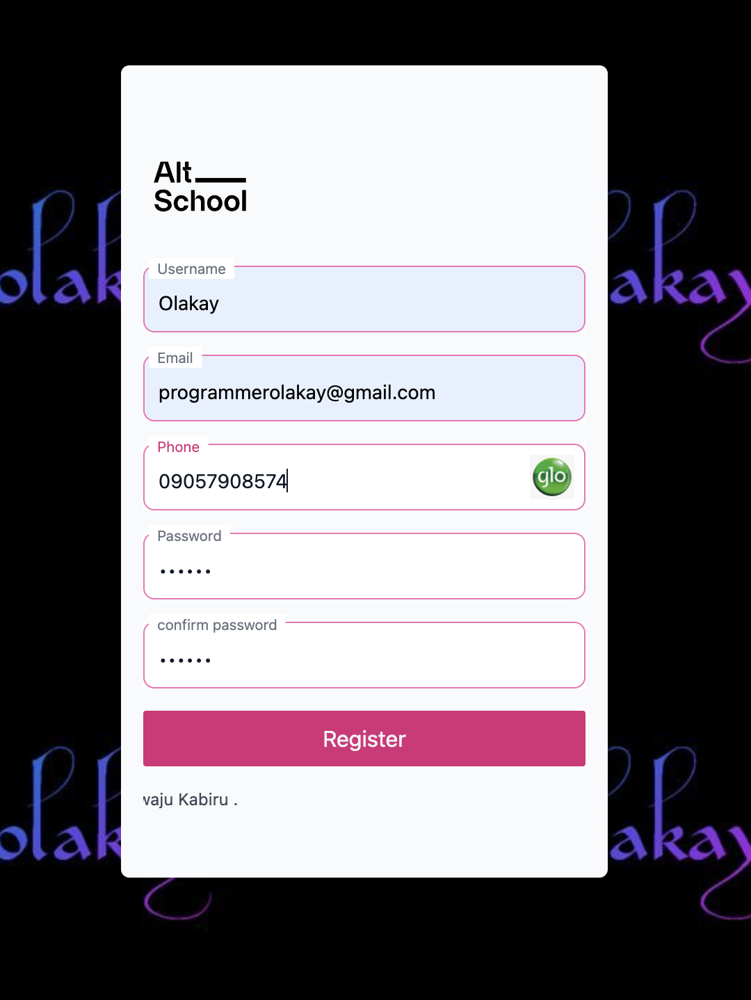

## ALTSCHOOL PHONE NUMBER CARRIER DETECTOR PROJECT

The task in the project is to detect the phone number carrier a visitor to my register page fill

## Follow the steps below to test it out

1. Navigate to ([https://carrier-detector.vercel.app/](https://carrier-detector.vercel.app/))
2. Fill the form 
3. At the phone number form input as you type in your mobile number the logo of the carrier is displayed to the rigth
4. At the password confirmation input, if the password does not match the confirmation password a validation error is returned.
5.On successfull registration a success message is received by the user 

&copy; [AltSchool Africa](https://www.altschoolafrica.com/)
